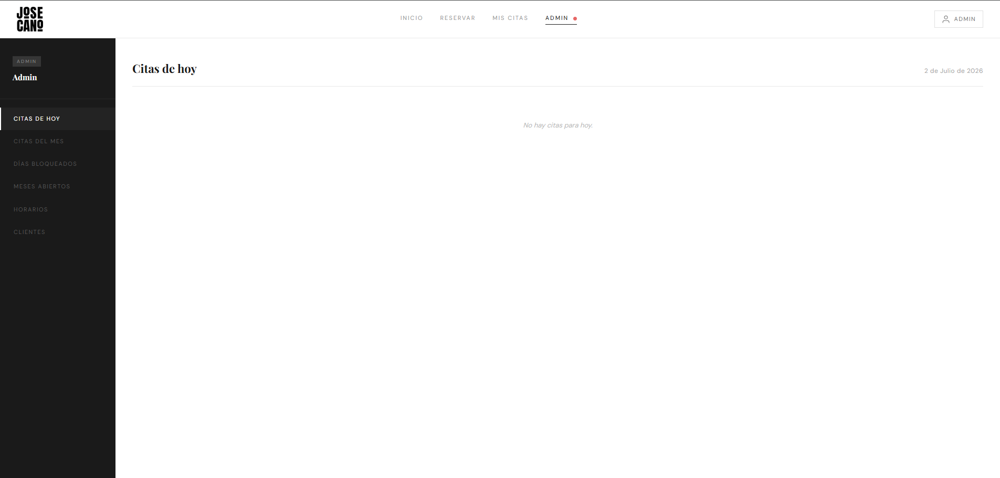
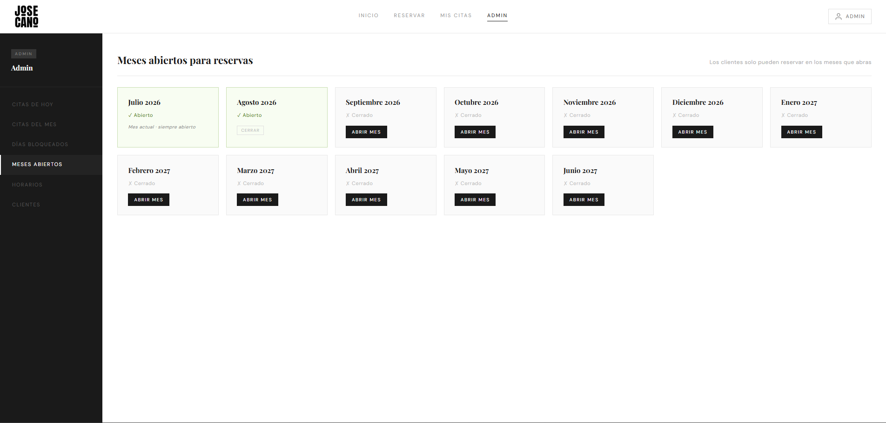
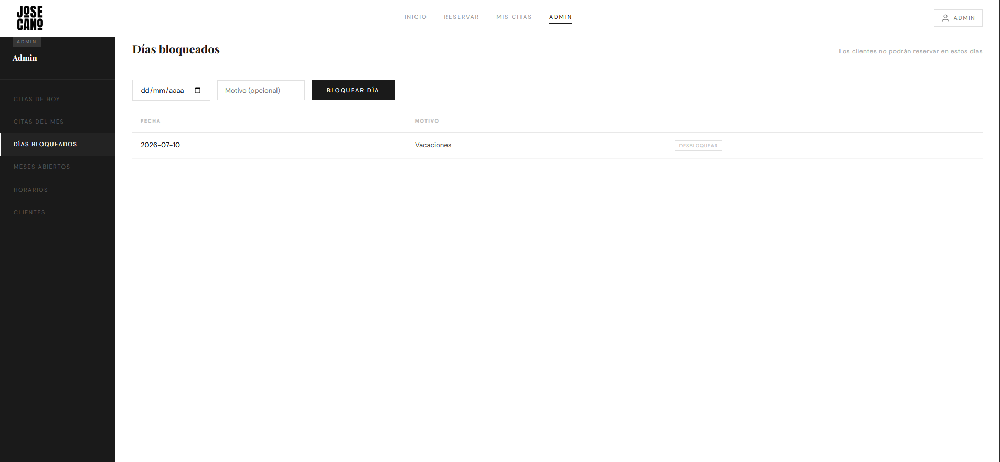
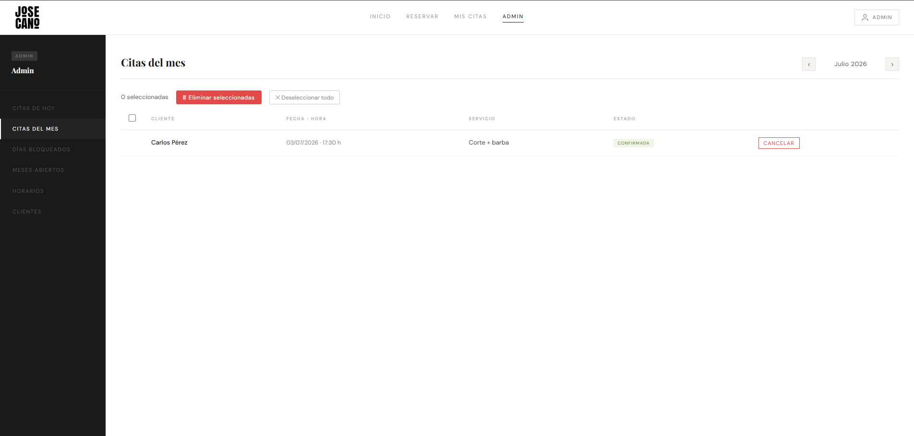
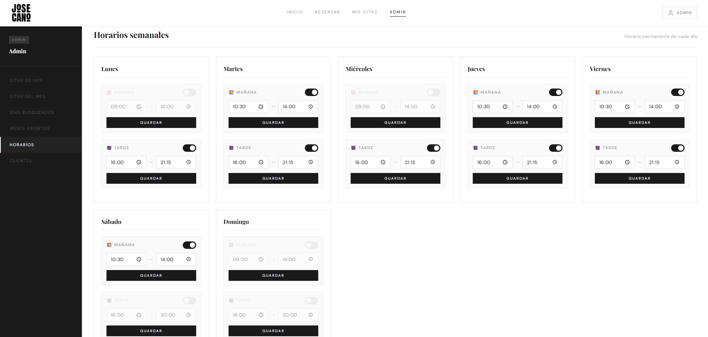
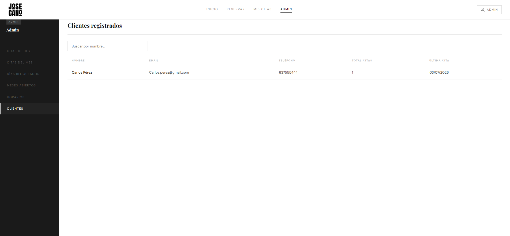

# 💈 Jose Cano Barbería — Sistema de Reservas Online

Aplicación web completa para la gestión de citas de una barbería real, desarrollada desde cero y desplegada en producción.

🌐 **Ver la web:** [josecanobarbería.com](https://xn--josecanobarbera-ipb.com)

---

## 🛠️ Tecnologías

- **Frontend:** HTML5, CSS3 y JavaScript vanilla con arquitectura **SPA** (Single Page Application) y router propio.
- **Backend:** PHP 8 con endpoints REST y PDO para la base de datos.
- **Autenticación:** Sesiones PHP + **Google OAuth 2.0**.
- **Correo:** PHPMailer con Gmail SMTP para notificaciones automáticas.
- **Despliegue:** Apache en Hostinger con HTTPS y HSTS.

---

## 👤 ¿Qué puede hacer un cliente?

- Registrarse con **email y contraseña** o directamente con **Google**.
- Verificar su cuenta por email antes del primer acceso.
- Reservar una cita eligiendo **servicio → día → hora** en un calendario interactivo.
- Consultar y **cancelar** sus propias citas desde "Mis citas".
- Recibir un **recordatorio por email 24 horas antes** de su cita.
- Recibir un **aviso por email** si el administrador cancela su cita.

---

## 🔐 Panel de administración

Acceso exclusivo para el administrador. Desde aquí gestiona toda la actividad de la barbería.
> *Los nombres de clientes que aparecen en las capturas son datos ficticios.*

---

### 📅 Citas de hoy
Resumen en tiempo real de todas las citas del día actual.

---

### 🗓️ Citas del mes
Listado paginado con navegación entre meses. Permite:
- **Cancelar** citas activas (el cliente recibe aviso por email).
- **Eliminar** definitivamente citas ya atendidas o canceladas.
- Usar **checkboxes** para eliminar varias citas a la vez.

---

### 🚫 Días bloqueados
El admin bloquea días concretos (vacaciones, festivos...) para que los clientes no puedan reservar en esas fechas.

---

### 📆 Meses abiertos para reservas
Control de qué meses están disponibles para reservas. El mes actual siempre está abierto; el resto los abre o cierra el admin.

---

### 🕐 Horarios semanales
Configuración del horario de la barbería por día y franja (mañana/tarde), con hora de apertura y cierre personalizables y opción de activar o desactivar cada franja.

---

### 👥 Clientes registrados
Listado de todos los usuarios con nombre, email, teléfono, número total de citas y fecha de la última visita. Incluye buscador en tiempo real.

---

## 📧 Notificaciones por email

| Evento | Destinatario |
|---|---|
| Registro de nueva cuenta | Cliente (verificación) |
| El admin cancela una cita | Cliente |
| El cliente cancela una cita | Admin |
| Recordatorio 24h antes de la cita | Cliente |

---

Desarrollado por **Alberto Vázquez Rando**
